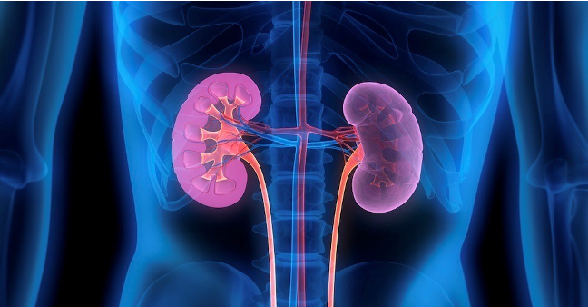
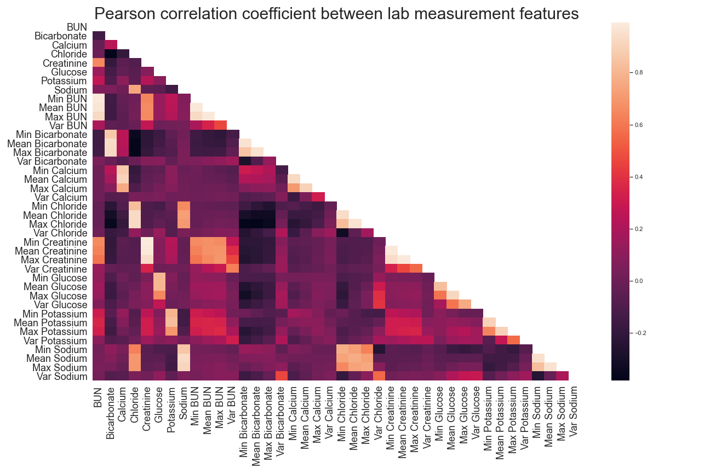
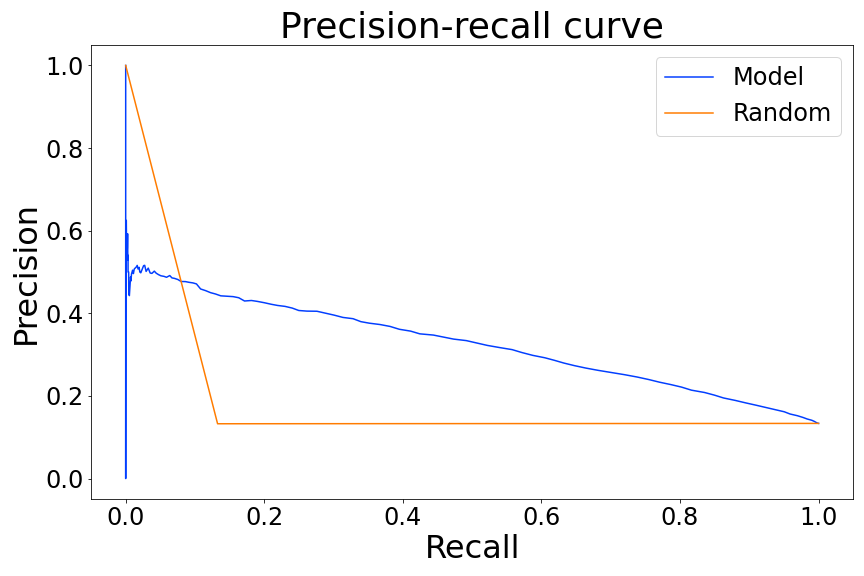
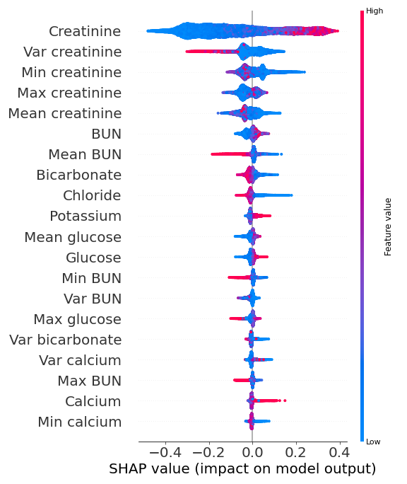

# AKIlert
### Enabling timely intervention for Acute Kidney Injury

This project aims to create an alert system for an impending risk of acute kidney injury (AKI) to enable timely intervention by the healthcare providers. A demonstration of the project was deployed to [Heroku.](https://akilert.herokuapp.com/)
Github [repo](https://github.com/zhakhverdyan/AKIlert-app) for the app. 

Link to slide [deck.](https://docs.google.com/presentation/d/1yu-OwJJLWtCPg1jeSClWu2mdHFdyMTq6Dv6G9M1w348/edit?usp=sharing)

### AKI facts

 20% of ICU pateints develop AKI. This is associated with negative patient outcomes and economic burden.

Patient outcomes:
* Mortality rate 20-25% higher
* ICU length of stay 3 days longer
Economic burden:
* Adds additional $8000/ stay, or $40,000 if the patient requires dialysis
* Estimated impact on annual hospitalization costs $5.4-$24 billion

### Data processing
 For this analysis, I decided to focus on dynamic features only. I generated data instances by aggregating the lab measurement in 2-day windows. Each window was assigned a label of 1 if it was < 36h away from an AKI episode and 0 otherwise. Next, I plotted the correlations between the resulting numerical features. Since the data is not independent (e.g., multiple rows per patient) and there are multiple colinearities, I decided to proceed with a decision tree-based model.
 

### Machine learning
Trained a random forest and XGBoost classifier and compared the average precision metric to a random classifier. Both models outperform the random classifier 2.5-fold. The model achieves 55% recall at 33% precision.
 

### Feature interpretation
The strongest feature appears to be creatinine, with higher levels influencing kidney injury positively.

